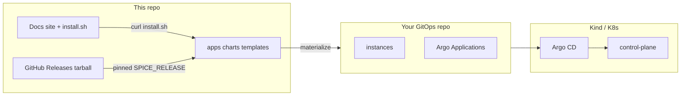

# Spice CDN — product vs GitOps

This repository is the **product**: Next.js control plane, Helm charts, installer, CI, and documentation site source. **Runtime GitOps** (what Argo CD reconciles) lives in a **separate repository** that you own.

**New here?** Read the **[user guide](docs/USER_GUIDE.md)** (quick start, optional settings, and end-to-end steps). Deep-dive Kind bootstrap steps are in **[docs/tutorial.md](docs/tutorial.md)**.



| Path | Role |
|------|------|
| [`apps/control-plane`](apps/control-plane) | Web UI + APIs (writes instance YAML in **GitOps** repo via GitHub Contents API / Octokit). |
| [`apps/control-plane-mcp`](apps/control-plane-mcp) | FastMCP sidecar. |
| [`charts/spice-instance`](charts/spice-instance) | Wrapper Helm chart (copied into your GitOps repo by the installer). |
| [`deploy/helm/control-plane`](deploy/helm/control-plane) | Control-plane chart (same). |
| [`templates/gitops/`](templates/gitops) | **Templates** for Argo manifests + bootstrap Helm values (`__GITOPS_*__` placeholders). |
| [`examples/instances/`](examples/instances) | Example `values.yaml` validated in CI — **not** cluster SoT. |
| [`scripts/install.sh`](scripts/install.sh) | Downloads a **GitHub Release** tarball, materializes a GitOps tree, bootstraps Kind + ingress + Vault + ESO + Argo. |
| [`website/`](website/) | Astro + Starlight site; build copies `install.sh` to `public/`. |
| [`docs/USER_GUIDE.md`](docs/USER_GUIDE.md) | **Full user guide:** quick start, optional install settings, step-by-step flow. |
| [`docs/tutorial.md`](docs/tutorial.md) | Manual Kind walkthrough (paths use `templates/gitops/bootstrap/...`). |
| [`docs/migration-two-repos.md`](docs/migration-two-repos.md) | Move from monorepo to product + GitOps. |

## Install (pinned release)

1. Create an empty **GitOps** GitHub repo and a PAT with **`repo`** scope.
2. From the **docs site** (GitHub Pages after you enable it), or from a release tarball:

```bash
curl -fsSL "https://<owner>.github.io/<repo>/install.sh" | bash
```

The served `install.sh` is copied from this repo at build time; **releases** set `SPICE_PACKAGED_RELEASE` inside the packaged script. Override with `SPICE_RELEASE=vX.Y.Z`.

**Local / dev** (uses the git checkout instead of downloading a release):

```bash
export SPICE_RELEASE=0.0.0-dev
./scripts/install.sh
```

**Materialize only** (no cluster):

```bash
./scripts/install.sh --materialize ./out --gitops-repo https://github.com/org/my-gitops.git
```

**Auto-upgrade** (re-download latest GitHub release and re-render tree):

```bash
export GITOPS_REPO_URL=https://github.com/org/my-gitops.git
./scripts/install.sh --upgrade
```

**Uninstall** (Kind cluster `spice-gitops`):

```bash
./scripts/install.sh --uninstall --all
```

## Releases

Tag `v*` → workflow [`.github/workflows/release.yml`](.github/workflows/release.yml) publishes `spice-platform-<tag>.tar.gz` + `.sha256` and attaches them to a GitHub Release.

## Control plane environment

Use **`GITOPS_REPO_OWNER`**, **`GITOPS_REPO_NAME`**, **`GITOPS_REPO_BRANCH`**, **`GITOPS_TOKEN`** (Helm: `env.gitopsRepo*` + `secrets.gitopsTokenSecretKey`). Legacy **`GITHUB_*`** env vars are still read for compatibility.

## CI

- Control plane / MCP images: existing GHCR workflows on `main`.
- Instance YAML lint: [`.github/workflows/validate-instances.yml`](.github/workflows/validate-instances.yml) on `examples/instances/**`.
- **Pages**: [`.github/workflows/pages.yml`](.github/workflows/pages.yml) builds `website/` and deploys to GitHub Pages (set repo variables `PUBLIC_ASTRO_SITE` / `PUBLIC_ASTRO_BASE` to override defaults).

## Makefile

```bash
make kind-create   # Kind cluster (hack/kind-config.yaml)
make kind-delete
```
